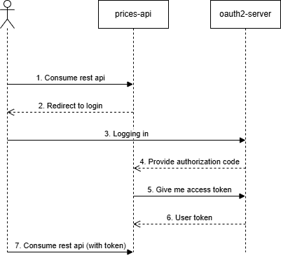

## Kairós Documentation - README.md

### Introduction
This project is designed to manage and retrieve pricing information dynamically. It allows querying price records based on brand, product, and application date. The API is developed in Java using Spring Boot and follows a microservices architecture.

### Technical Details

The project is a pricing API developed in Java using Spring Boot. The main technical features of the project are:

- **Java Version**: 21
- **Spring Boot Version**: 3.4.2
- **Maven Version**: 3.9.x
- **Programming Language**: Java
- **Framework**: Spring Boot
- **Dependency Management**: Maven
- **Database**: SQL
- **User Database**: LDAP(UnboundID)
- **Validation**: Jakarta Validation
- **API Documentation**: Swagger (OpenAPI)
- **Security**: Spring Security
- **Architecture**: REST-based controllers
- **Code formatting**: OpenRewrite
- **CI/CD**: GitHub Actions

The project includes multiple layers, such as REST controllers, services, and mappers to handle API requests and responses.

### Sequence Diagram



### Starting the Project

Before running the services, ensure that the required JDK version (JDK-21) are correctly set up.

#### Configuration Server
```bash
mvn -pl config-server spring-boot:run
```

#### LDAP Server
```bash
mvn -pl ldap-server spring-boot:run
```

#### OAuth2 Server
```bash
mvn -pl oauth-server spring-boot:run
```

#### Prices API
```bash
mvn -pl prices-api spring-boot:run
```

### Obtaining the Access Token

Get the token from the URL: [OAuth2 login page](http://localhost:8080/login/oauth2/code/prices-api)

You can authenticate with the following users:

- **Username-Password**: ben-ben
- **Username-Password**: bob-bob
- **Username-Password**: edwin-edwin

- **Application Roles**:
    - **ROLE_FINANCIAL**: edwin
    - **ROLE_USERS**: ben, bob
    - **ROLE_ADMIN**: ben

### Main API Endpoints

| Method  | Endpoint         | Description                          |
|---------|-----------------|--------------------------------------|
| `POST`  | `/v1/price`      | Retrieves the price for a product   |

### Consuming the API via REST Client

```bash
POST http://localhost:8080/v1/price
Authorization: Bearer <ACCESS_TOKEN>
Content-Type: application/json

{
  "productId": 35455,
  "brandId": 1,
  "applicationDate": "2020-06-16T21:00:00"
}
```

#### Example Response
```json
{
  "productId": 35455,
  "brandId": 1,
  "name": "Rate 4",
  "startDate": "2020-06-15T16:00:00Z",
  "endDate": "2020-12-31T23:59:59Z",
  "price": 38.95
}
```

### Running Tests
To execute the automated tests, run:
```bash
mvn test
```

### API Documentation

The API documentation is available at: [Swagger UI](http://localhost:8080/swagger-ui/index.html)

### GitHub Actions

GitHub Actions is used to automate the build and deployment process. The CI/CD pipeline runs on every push and pull request to ensure code quality and stability.

To check the latest build status, visit the [GitHub Actions page](https://github.com/ednonufix/kairos-challenge/actions).

